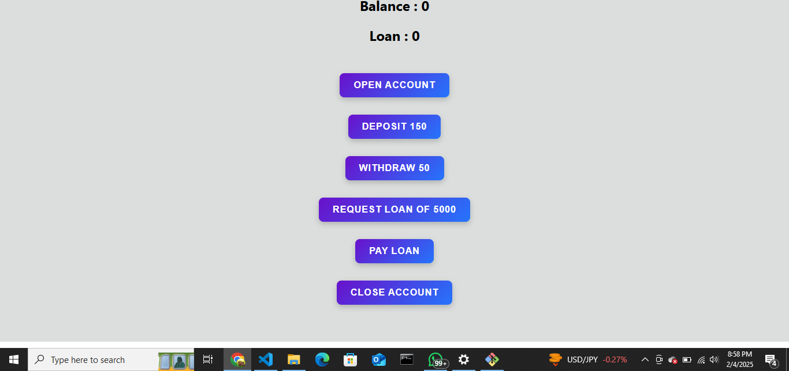
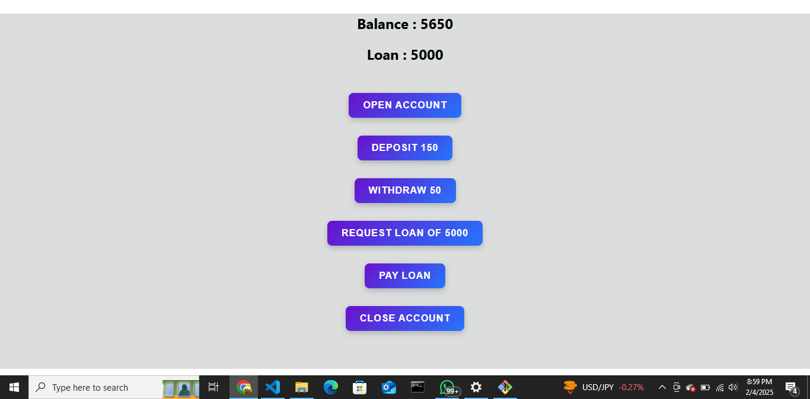

# Banking App

This is a simple banking app built with React and useReducer for state management. The application allows users to open an account, deposit and withdraw money, request and pay back loans, and close their account.

## Features
- Open an account with an initial balance of $500.
- Deposit $150 at a time.
- Withdraw $50 at a time (only if balance is sufficient).
- Request a loan of $5000 (only if no active loan and account is open).
- Pay back a loan of $5000 (only if a loan is active).
- Close account (only if balance and loan are cleared).

## Installation
1. Clone the repository:
   ```sh
   git clone https://github.com/Zakyboss/banking-app.git
   ```
2. Navigate to the project folder:
   ```sh
   cd banking-app
   ```
3. Install dependencies:
   ```sh
   npm install
   ```
4. Start the development server:
   ```sh
   npm start
   ```

## Screenshots
Below are two screenshots of the application located in the `public` folder:
- **Screenshot1** 
- **Screenshot2** 

## File Structure
```
/banking-app
  /src
    /components
      Main.js
      Output.js
      OpenAccount.js
      Deposit.js
      Withdraw.js
      RequestLoan.js
      PayLoan.js
      CloseAccount.js
    App.js
    index.js
    index.css
  /public
    Screenshot1.png
    Screenshot2.png
  README.md
  package.json
  .gitignore
```

## Technologies Used
- React.js
- useReducer Hook
- CSS

## Author
**Zakariya Mohamed** (GitHub: [Zakyboss](https://github.com/Zakyboss))

## License
This project is open-source and available under the MIT License.

